# Proyek Website F&B E-Commerce with Chatbot AI Integration

## Deskripsi Singkat Proyek

F&B E-Commerce with Chatbot AI Integration adalah sebuah platform penjualan makanan dan minuman berbasis web yang dilengkapi dengan chatbot AI untuk meningkatkan pengalaman pengguna. Sistem ini memungkinkan pelanggan melakukan pemesanan, menanyakan menu, mendapatkan rekomendasi, serta melakukan transaksi dengan cepat dan efisien melalui antarmuka yang interaktif. Integrasi chatbot AI membantu memberikan layanan otomatis 24/7 sehingga proses pemesanan menjadi lebih mudah, responsif, dan personal.

## Fitur Utama

### Fitur Pembeli

- **Fitur basic marketplace:**
    - Cari, filter, sortir, wishlist makanan atau minuman
    - Checkout barang
    - Menampilkan cabang terdekat
- **AI Chatbot (via Telegram):**
    - Notifikasi jika pesanan akan sampai
    - Notifikasi makanan dan minuman rekomendasi yang sedang diskon berdasarkan riwayat pembelian
- **Fitur delivery makanan:**
    - Transaksi pembayaran COD dan transfer
    - Pengarahan otomatis pesanan pelanggan pada cabang terdekat toko

### Fitur Admin/Perusahaan

- **Manajemen produk:**
    - Content management system (CRUD produk yang dijual)
- **Manajemen keuangan:**
    - Pencatatan cash flow penjualan (per hari/bulan/tahun)
- **Manajemen pelanggan atau customer:**
    - Laporan evaluasi produk berdasarkan rating
    - Laporan pembelian produk berdasarkan area pembeli

## Teknologi yang Digunakan

- **Front End:** HTML, CSS, Tailwind CSS, Javascript, React
- **Backend:** PHP, Laravel
- **Database:** MySQL
- **Hosting:** Jagoan Kode Cloud
- **Domain:** my.id
- **AI:** OpenRouter, DeepSeek
- **Alat Otomatisasi:** N8N

## Penjelasan Setiap Halaman

Berikut adalah ringkasan singkat dari setiap halaman utama dalam aplikasi:

- **Beranda:** Halaman utama untuk pengenalan platform, promo, rekomendasi produk, dan navigasi.
- **Profile Customer:** Menampilkan dan mengelola data pribadi pelanggan.
- **Produk Kami:** Daftar seluruh makanan dan minuman yang tersedia, dengan fitur pencarian, filter, dan sortir.
- **Detail Produk:** Informasi lengkap mengenai produk, deskripsi, harga, rating, ulasan, serta opsi pembelian.
- **Keranjang Pesanan:** Daftar produk yang telah dipilih sebelum checkout, dengan opsi pengelolaan jumlah dan penghapusan.
- **Dashboard - Overview:** Ringkasan kondisi sistem untuk admin (total penjualan, pesanan, pelanggan, performa bisnis).
- **Dashboard - Analytics:** Data analitik dalam bentuk grafik (tren penjualan, produk terlaris, performa transaksi).
- **Manajemen Produk:** Admin dapat mengelola data produk (CRUD).
- **Manajemen Keuangan - Overview:** Ringkasan kondisi keuangan perusahaan (pemasukan, pengeluaran, laba).
- **Manajemen Keuangan - Charts:** Visualisasi data keuangan dalam bentuk grafik (cash flow, tren).
- **Manajemen Keuangan - Transactions:** Daftar detail transaksi keuangan (riwayat, tanggal, jumlah, jenis).
- **Manajemen Pelanggan - Overview:** Ringkasan data pelanggan (jumlah, aktif, statistik interaksi).
- **Manajemen Pelanggan - Data Pelanggan:** Daftar detail pelanggan, riwayat pembelian, dan pengelolaan data.
- **Manajemen Pelanggan - Evaluasi Produk:** Hasil penilaian dan ulasan pelanggan untuk evaluasi kualitas produk.
- **Manajemen Pelanggan - Laporan Area:** Laporan pembelian berdasarkan wilayah atau area pelanggan untuk strategi pemasaran.
- **Status Pesanan:** Memantau proses pesanan (menunggu, diproses, dikirim, selesai).
- **Notifikasi:** Pemberitahuan penting seperti status pesanan dan rekomendasi menu AI.

## Tampilan Website

Berikut adalah beberapa screenshot dari tampilan website:

### Halaman Home

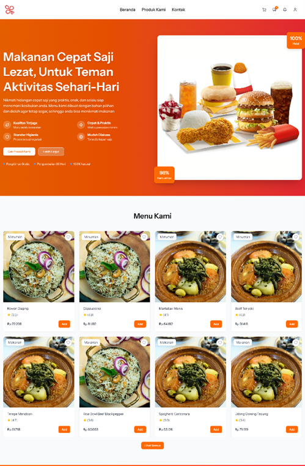
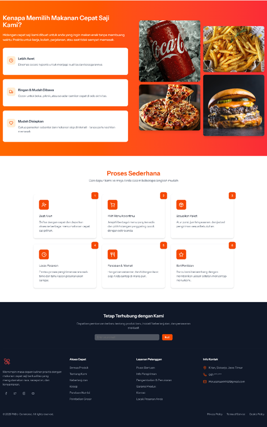

### Halaman Detail Produk

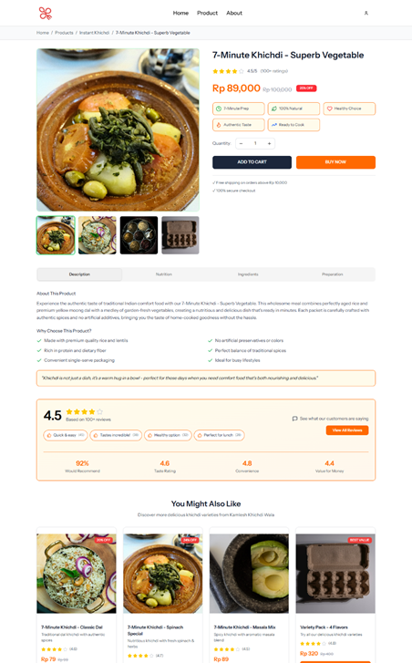

### Halaman Listing Produk

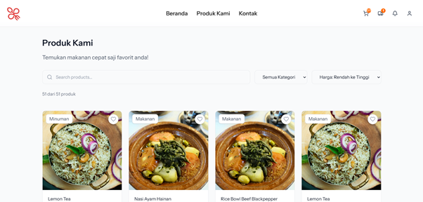

### Halaman Keranjang

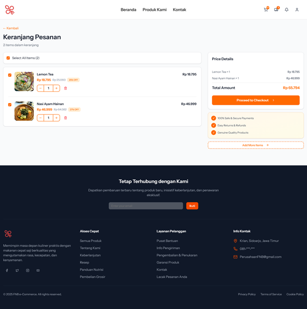

### Halaman Profil

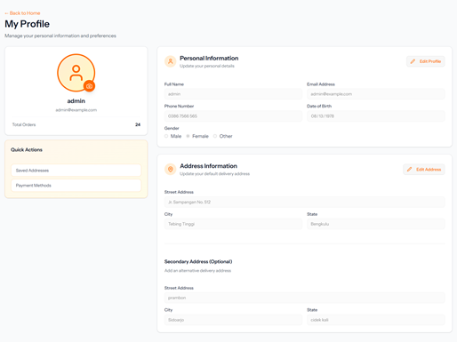

### Halaman Status Pemesanan

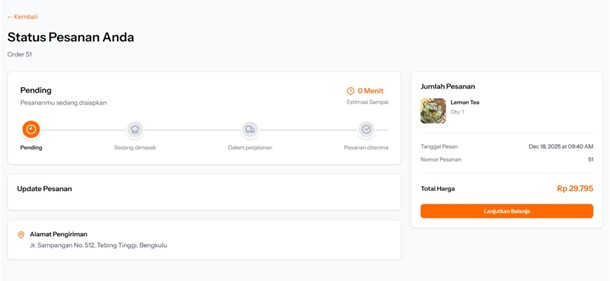

### Halaman Notifikasi

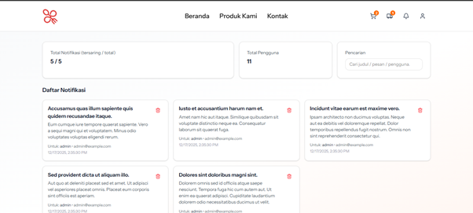

### Halaman Dashboard Overview

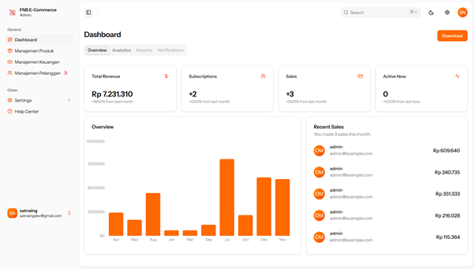

### Halaman Dashboard Analytics

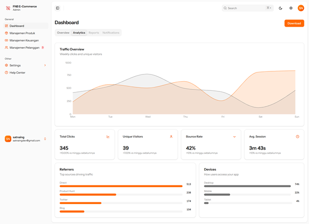

### Halaman Manajemen Produk

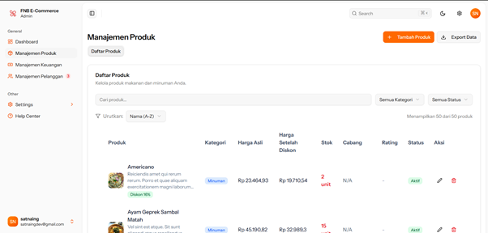

### Halaman Manajemen Keuangan Overview

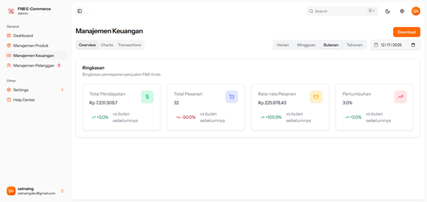

### Halaman Manajemen Keuangan Charts

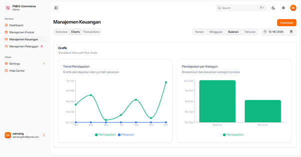

### Halaman Manajemen Keuangan Transactions

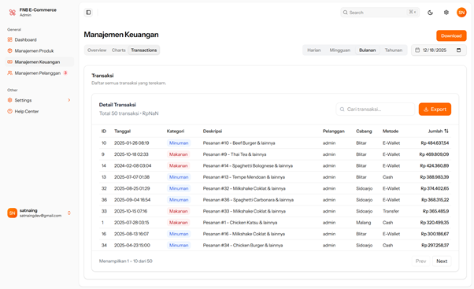

### Halaman Manajemen Pelanggan Overview

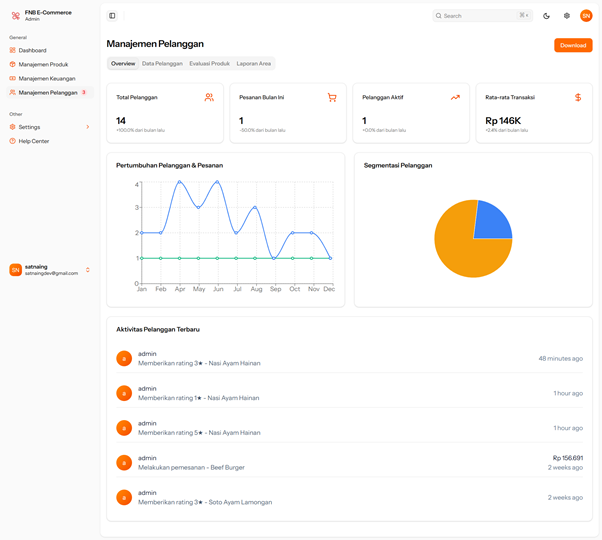

### Halaman Manajemen Pelanggan Data Pelanggan

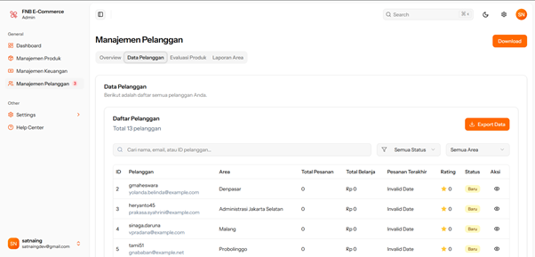

### Halaman Manajemen Pelanggan Evaluasi Produk

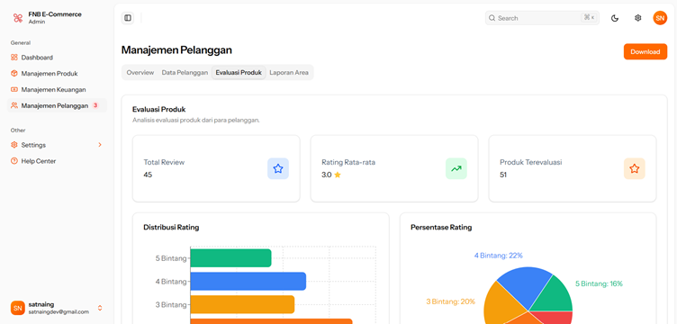

### Halaman Manajemen Pelanggan Laporan Area

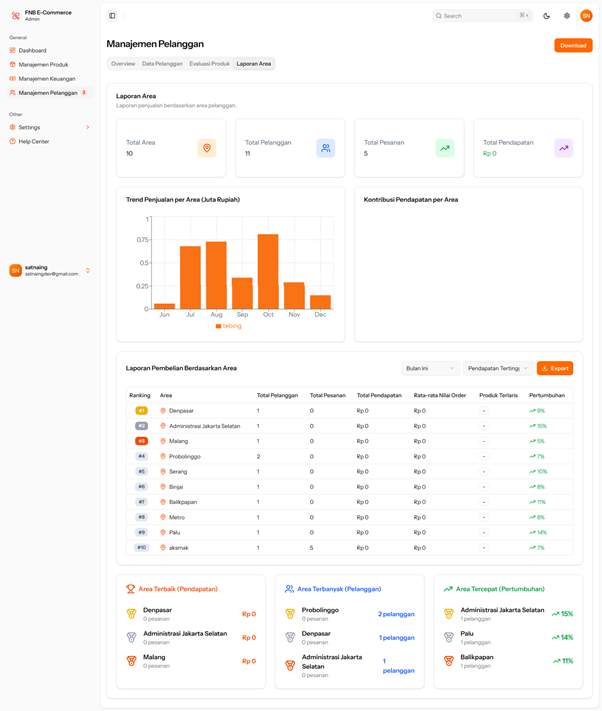

## Cara Menjalankan Aplikasi

---

### Prasyarat

Sebelum memulai, pastikan Anda telah menginstal perangkat lunak berikut di mesin pengembangan Anda:

- PHP 8.2 atau lebih tinggi
- Composer (Manajer Paket PHP)
- Node.js v18 atau lebih tinggi
- NPM atau Yarn (Manajer Paket JavaScript)
- Database Server (misalnya, MySQL, MariaDB, atau SQLite)

---

### Panduan Instalasi dan Konfigurasi

Ikuti langkah-langkah berikut untuk menyiapkan proyek di lingkungan lokal Anda.

#### 1. Clone Repositori

Pertama, clone repositori ini ke mesin lokal Anda menggunakan Git.

```bash
git clone https://github.com/FnBEcommerce/Website-FnB-E-Commerce-2.git
cd Website-FnB-E-Commerce-2
```

#### 2. Instal Dependensi PHP

Instal semua dependensi backend yang diperlukan menggunakan Composer.

```bash
composer install
```

#### 3. Instal Dependensi JavaScript

Instal semua dependensi frontend yang diperlukan menggunakan NPM.

```bash
npm install
```

#### 4. Konfigurasi Environment

Salin file `.env` yang ada untuk membuat file konfigurasi environment lokal Anda.

```bash
cp .env.example .env
```

Setelah file `.env` dibuat, buat kunci aplikasi (APP_KEY) yang unik untuk proyek Anda.

```bash
php artisan key:generate
```

#### 5. Konfigurasi Database

Buka file `.env` dan sesuaikan pengaturan database sesuai dengan konfigurasi lokal Anda.

**Contoh untuk MySQL:**

```
DB_CONNECTION=mysql
DB_HOST=127.0.0.1
DB_PORT=3306
DB_DATABASE=fnb
DB_USERNAME=root
DB_PASSWORD=
```

#### 6. Jalankan Migrasi Database

Setelah konfigurasi database selesai, jalankan migrasi untuk membuat semua tabel yang diperlukan.

```bash
php artisan migrate
```

Jalankan seeder untuk mengisi database dengan data awal.

```bash
php artisan db:seed
```

#### 7. Buat Symbolic Link untuk Storage

Buat symbolic link agar file yang diunggah ke `storage/app/public` dapat diakses dari direktori `public`.

```bash
php artisan storage:link
```

#### 8. Konfigurasi Sistem Pembayaran

Buka file `.env` dan sesuaikan pengaturan midtrans sesuai dengan milik Anda. Informasi selengkapnya terdapat pada panduan [Midtrans Snap Integration Guide](https://docs.midtrans.com/docs/snap-snap-integration-guide).

Contoh konfigurasi:

```
MIDTRANS_MERCHANT_ID=GXXXXXXXXX
MIDTRANS_CLIENT_KEY=SB-Mid-client-XXXXXXXXXXXXXXXX
MIDTRANS_SERVER_KEY=SB-Mid-server-XXXXXXXXXXXXXXXXXXXXXXXX
```

---

### Menjalankan Aplikasi

Aplikasi ini memerlukan dua proses yang berjalan secara bersamaan di mode pengembangan: server Vite untuk aset frontend dan server Laravel untuk backend.

#### 1. Jalankan Server Vite

Buka terminal **pertama** dan jalankan server pengembangan Vite. Server ini akan meng-compile aset frontend dan menyediakan _hot-reloading_.

```bash
npm run dev
```

#### 2. Jalankan Server Laravel

Buka terminal **kedua** dan jalankan server pengembangan PHP menggunakan Artisan.

```bash
php artisan serve
```

Setelah kedua server berjalan, Anda dapat mengakses aplikasi di alamat yang ditampilkan oleh `artisan serve` (`http://127.0.0.1:8000`).

---

### Perintah Penting Lainnya

#### Build untuk Produksi

Untuk meng-compile dan mem-bundle aset frontend untuk lingkungan produksi, jalankan perintah berikut:

```bash
npm run build
```

## Link Website

[fnbku.my.id](http://fnbku.my.id)
